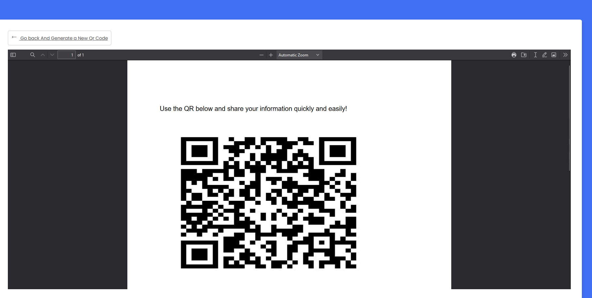

# Project Readme

## Project Overview

This project involves the creation of a small webpage with a form that collects user information, including full name, email, and phone number. Upon submitting the form, a PDF file will be generated, containing a QR code encoding the entered data.


## Usage

1. **Fill out the Form:**
    - Enter your full name, email, and phone number in the respective input fields.

2. **Click Submit:**
    - Click the submit button to generate a PDF file.

3. **Retrieve PDF:**
    - Retrieve the generated PDF file containing a QR code.

## Dependencies

python 3.11


## Installation

1. **Clone the Repository:**
   ```bash
   git clone https://github.com/your-username/your-repository.git
   pip install requirements



